# Diagrama Entidad-Relación - Sistema AgroFeria

## Requisitos del Sistema
- Responsive
- Diseño común de formularios
- Acceso al Sistema (login)
- Nuevo usuario (según perfil)
- Ver/Editar perfil
- Recuperar contraseña
- Recordar usuario/sesión
- Bloqueo temporal (seguridad)
- Términos y uso / Política privacidad
- Notificaciones / Alertas seguras
- Ayuda contextual
- Tablas de usuarios (DB)

## Diagrama ER en Mermaid

```mermaid
erDiagram
    %% ========================================
    %% ENTIDAD: USUARIOS
    %% ========================================
    USERS {
        int user_id PK
        string username UK
        string email UK
        string password_hash
        enum role "ADMIN, PRODUCER, COORDINATOR"
        boolean is_active
        boolean is_blocked
        datetime blocked_until
        int failed_login_attempts
        datetime last_login
        datetime last_password_change
        boolean remember_session
        string session_token
        datetime session_expires_at
        boolean terms_accepted
        datetime terms_accepted_date
        boolean privacy_accepted
        datetime privacy_accepted_date
        datetime created_at
        datetime updated_at
    }

    %% ========================================
    %% ENTIDAD: PRODUCTORES
    %% ========================================
    PRODUCERS {
        int producer_id PK
        int user_id FK
        string name
        string last_name
        enum document_type "DNI, RUC, CE"
        string document_number UK
        string email
        string phone
        string address
        string province
        string canton
        decimal farm_size
        datetime registration_date
        datetime created_at
        datetime updated_at
    }

    %% ========================================
    %% ENTIDAD: TIPOS DE PRODUCTOS
    %% ========================================
    PRODUCT_TYPES {
        int product_type_id PK
        string name UK
        string description
        datetime created_at
    }

    %% ========================================
    %% RELACIÓN: PRODUCTORES - TIPOS DE PRODUCTOS
    %% ========================================
    PRODUCER_PRODUCTS {
        int producer_product_id PK
        int producer_id FK
        int product_type_id FK
        datetime created_at
    }

    %% ========================================
    %% ENTIDAD: FERIAS
    %% ========================================
    FAIRS {
        int fair_id PK
        string name
        text description
        string location
        date start_date
        date end_date
        time start_time
        time end_time
        enum status "PLANNED, ACTIVE, COMPLETED, CANCELLED"
        int max_participants
        int current_participants
        datetime created_at
        datetime updated_at
    }

    %% ========================================
    %% ENTIDAD: INSCRIPCIONES A FERIAS
    %% ========================================
    FAIR_REGISTRATIONS {
        int registration_id PK
        int producer_id FK
        int fair_id FK
        text products_to_sell
        decimal estimated_quantity
        boolean needs_transport
        enum status "PENDING, APPROVED, REJECTED, CANCELLED"
        datetime registration_date
        datetime approved_date
        int approved_by_user_id FK
        text rejection_reason
        datetime created_at
        datetime updated_at
    }

    %% ========================================
    %% ENTIDAD: VENTAS
    %% ========================================
    SALES {
        int sale_id PK
        int registration_id FK
        decimal total_amount
        text products_sold
        date sale_date
        text notes
        datetime created_at
        datetime updated_at
    }

    %% ========================================
    %% ENTIDAD: TRANSPORTE
    %% ========================================
    TRANSPORT {
        int transport_id PK
        int fair_id FK
        string route
        date transport_date
        time departure_time
        int capacity
        int current_passengers
        enum status "SCHEDULED, IN_PROGRESS, COMPLETED, CANCELLED"
        datetime created_at
        datetime updated_at
    }

    %% ========================================
    %% RELACIÓN: PRODUCTORES - TRANSPORTE
    %% ========================================
    TRANSPORT_ASSIGNMENTS {
        int assignment_id PK
        int transport_id FK
        int producer_id FK
        string pickup_location
        boolean confirmed
        datetime created_at
    }

    %% ========================================
    %% ENTIDAD: RECUPERACIÓN DE CONTRASEÑA
    %% ========================================
    PASSWORD_RESET_TOKENS {
        int token_id PK
        int user_id FK
        string token UK
        datetime expires_at
        boolean used
        datetime used_at
        datetime created_at
    }

    %% ========================================
    %% ENTIDAD: NOTIFICACIONES
    %% ========================================
    NOTIFICATIONS {
        int notification_id PK
        int user_id FK
        string title
        text message
        enum type "INFO, WARNING, SUCCESS, ERROR"
        enum category "SYSTEM, FAIR, REGISTRATION, TRANSPORT, SECURITY"
        boolean is_read
        datetime read_at
        string action_url
        datetime created_at
    }

    %% ========================================
    %% ENTIDAD: ALERTAS DE SEGURIDAD
    %% ========================================
    SECURITY_ALERTS {
        int alert_id PK
        int user_id FK
        enum alert_type "FAILED_LOGIN, PASSWORD_CHANGE, ACCOUNT_BLOCKED, SUSPICIOUS_ACTIVITY"
        string ip_address
        text description
        datetime created_at
    }

    %% ========================================
    %% ENTIDAD: AYUDA CONTEXTUAL
    %% ========================================
    CONTEXTUAL_HELP {
        int help_id PK
        string page_key UK
        string section_key
        string title
        text content
        string video_url
        enum language "ES, EN"
        boolean is_active
        datetime created_at
        datetime updated_at
    }

    %% ========================================
    %% ENTIDAD: TÉRMINOS Y CONDICIONES
    %% ========================================
    TERMS_AND_CONDITIONS {
        int terms_id PK
        string version UK
        text content
        date effective_date
        boolean is_current
        datetime created_at
    }

    %% ========================================
    %% ENTIDAD: POLÍTICA DE PRIVACIDAD
    %% ========================================
    PRIVACY_POLICY {
        int policy_id PK
        string version UK
        text content
        date effective_date
        boolean is_current
        datetime created_at
    }

    %% ========================================
    %% ENTIDAD: REGISTRO DE AUDITORÍA
    %% ========================================
    AUDIT_LOG {
        int log_id PK
        int user_id FK
        string action
        string table_name
        int record_id
        text old_values
        text new_values
        string ip_address
        datetime created_at
    }

    %% ========================================
    %% ENTIDAD: CONFIGURACIÓN DEL SISTEMA
    %% ========================================
    SYSTEM_CONFIG {
        int config_id PK
        string config_key UK
        string config_value
        string description
        datetime updated_at
    }

    %% ========================================
    %% RELACIONES
    %% ========================================
    
    %% Usuario - Productor (1:1)
    USERS ||--o| PRODUCERS : "es"
    
    %% Usuario - Notificaciones (1:N)
    USERS ||--o{ NOTIFICATIONS : "recibe"
    
    %% Usuario - Alertas de Seguridad (1:N)
    USERS ||--o{ SECURITY_ALERTS : "genera"
    
    %% Usuario - Tokens de Recuperación (1:N)
    USERS ||--o{ PASSWORD_RESET_TOKENS : "solicita"
    
    %% Usuario - Registro de Auditoría (1:N)
    USERS ||--o{ AUDIT_LOG : "realiza"
    
    %% Productor - Productos (M:N a través de PRODUCER_PRODUCTS)
    PRODUCERS ||--o{ PRODUCER_PRODUCTS : "produce"
    PRODUCT_TYPES ||--o{ PRODUCER_PRODUCTS : "incluye"
    
    %% Productor - Inscripciones (1:N)
    PRODUCERS ||--o{ FAIR_REGISTRATIONS : "se_inscribe"
    
    %% Productor - Transporte (M:N a través de TRANSPORT_ASSIGNMENTS)
    PRODUCERS ||--o{ TRANSPORT_ASSIGNMENTS : "usa"
    TRANSPORT ||--o{ TRANSPORT_ASSIGNMENTS : "asigna"
    
    %% Feria - Inscripciones (1:N)
    FAIRS ||--o{ FAIR_REGISTRATIONS : "recibe"
    
    %% Feria - Transporte (1:N)
    FAIRS ||--o{ TRANSPORT : "organiza"
    
    %% Inscripción - Ventas (1:N)
    FAIR_REGISTRATIONS ||--o{ SALES : "genera"
    
    %% Usuario (Admin) - Inscripciones aprobadas (1:N)
    USERS ||--o{ FAIR_REGISTRATIONS : "aprueba"
```



## Descripción de Entidades Principales

### 1. USERS (Usuarios)
Tabla central del sistema que gestiona:
- **Autenticación**: username, password_hash
- **Seguridad**: is_blocked, blocked_until, failed_login_attempts
- **Sesiones**: remember_session, session_token, session_expires_at
- **Términos legales**: terms_accepted, privacy_accepted
- **Roles**: ADMIN, PRODUCER, COORDINATOR

### 2. PRODUCERS (Productores)
Perfil específico de los productores que incluye:
- Datos personales y de contacto
- Información de ubicación
- Datos de producción (tamaño de finca)
- Relación 1:1 con USERS

### 3. PRODUCT_TYPES (Tipos de Productos)
Catálogo de productos agrícolas disponibles

### 4. PRODUCER_PRODUCTS (Productos del Productor)
Tabla de relación M:N entre productores y tipos de productos

### 5. FAIRS (Ferias)
Información de las ferias agroproductivas:
- Datos básicos (nombre, descripción, ubicación)
- Fechas y horarios
- Control de capacidad
- Estados (PLANNED, ACTIVE, COMPLETED, CANCELLED)

### 6. FAIR_REGISTRATIONS (Inscripciones a Ferias)
Registro de participación de productores en ferias:
- Productos a vender
- Necesidad de transporte
- Estados de aprobación
- Seguimiento de aprobaciones

### 7. SALES (Ventas)
Registro de ventas realizadas en las ferias

### 8. TRANSPORT (Transporte)
Organización del transporte para las ferias:
- Rutas y horarios
- Capacidad y ocupación
- Estados del servicio

### 9. TRANSPORT_ASSIGNMENTS (Asignaciones de Transporte)
Relación M:N entre productores y transportes

### 10. PASSWORD_RESET_TOKENS (Tokens de Recuperación)
Sistema de recuperación de contraseña:
- Tokens únicos con expiración
- Control de uso único

### 11. NOTIFICATIONS (Notificaciones)
Sistema de notificaciones al usuario:
- Tipos: INFO, WARNING, SUCCESS, ERROR
- Categorías: SYSTEM, FAIR, REGISTRATION, TRANSPORT, SECURITY
- Estado de lectura
- Acciones asociadas

### 12. SECURITY_ALERTS (Alertas de Seguridad)
Registro de eventos de seguridad:
- Intentos de login fallidos
- Cambios de contraseña
- Bloqueos de cuenta
- Actividad sospechosa
- Dirección IP del evento

### 13. CONTEXTUAL_HELP (Ayuda Contextual)
Sistema de ayuda integrado:
- Ayuda por página/sección
- Soporte multiidioma (ES, EN)
- Contenido multimedia (texto, video)

### 14. TERMS_AND_CONDITIONS (Términos y Condiciones)
Versionado de términos y condiciones:
- Control de versiones
- Fecha de entrada en vigor
- Versión actual activa

### 15. PRIVACY_POLICY (Política de Privacidad)
Versionado de política de privacidad:
- Control de versiones
- Fecha de entrada en vigor
- Versión actual activa

### 16. AUDIT_LOG (Registro de Auditoría)
Trazabilidad completa del sistema:
- Acciones de usuarios
- Cambios en registros (old_values, new_values)
- IP de origen
- Timestamp de la acción

### 17. SYSTEM_CONFIG (Configuración del Sistema)
Parámetros configurables del sistema:
- Tiempo de bloqueo de cuenta
- Número máximo de intentos de login
- Tiempo de expiración de sesión
- Configuraciones de notificaciones

## Índices Recomendados

```sql
-- USERS
CREATE INDEX idx_users_username ON USERS(username);
CREATE INDEX idx_users_email ON USERS(email);
CREATE INDEX idx_users_session_token ON USERS(session_token);
CREATE INDEX idx_users_is_active ON USERS(is_active);

-- PRODUCERS
CREATE INDEX idx_producers_user_id ON PRODUCERS(user_id);
CREATE INDEX idx_producers_document_number ON PRODUCERS(document_number);
CREATE INDEX idx_producers_province ON PRODUCERS(province);

-- FAIR_REGISTRATIONS
CREATE INDEX idx_registrations_producer_id ON FAIR_REGISTRATIONS(producer_id);
CREATE INDEX idx_registrations_fair_id ON FAIR_REGISTRATIONS(fair_id);
CREATE INDEX idx_registrations_status ON FAIR_REGISTRATIONS(status);

-- NOTIFICATIONS
CREATE INDEX idx_notifications_user_id ON NOTIFICATIONS(user_id);
CREATE INDEX idx_notifications_is_read ON NOTIFICATIONS(is_read);
CREATE INDEX idx_notifications_created_at ON NOTIFICATIONS(created_at);

-- SECURITY_ALERTS
CREATE INDEX idx_security_alerts_user_id ON SECURITY_ALERTS(user_id);
CREATE INDEX idx_security_alerts_type ON SECURITY_ALERTS(alert_type);

-- PASSWORD_RESET_TOKENS
CREATE INDEX idx_password_reset_token ON PASSWORD_RESET_TOKENS(token);
CREATE INDEX idx_password_reset_user_id ON PASSWORD_RESET_TOKENS(user_id);

-- AUDIT_LOG
CREATE INDEX idx_audit_log_user_id ON AUDIT_LOG(user_id);
CREATE INDEX idx_audit_log_table_record ON AUDIT_LOG(table_name, record_id);
CREATE INDEX idx_audit_log_created_at ON AUDIT_LOG(created_at);
```

## Notas de Implementación

### Seguridad
1. **Contraseñas**: Usar bcrypt o Argon2 para hash
2. **Tokens de sesión**: Generar con crypto aleatorio seguro
3. **Bloqueo de cuenta**: Automático después de N intentos fallidos
4. **Registro de IP**: Para auditoría y detección de anomalías

### Sesiones
1. **Remember me**: Token persistente con expiración extendida
2. **Timeout de sesión**: Configurable en SYSTEM_CONFIG
3. **Logout**: Invalidar session_token

### Notificaciones
1. **Push notifications**: Integración con WebSocket/SSE
2. **Email**: Para eventos críticos
3. **In-app**: Notificaciones dentro de la aplicación

### GDPR/Privacidad
1. **Aceptación de términos**: Requerida en registro
2. **Versionado**: Control de cambios en términos
3. **Right to be forgotten**: Soft delete de usuarios
4. **Exportación de datos**: Para cumplimiento GDPR

### Auditoría
1. **Todas las acciones críticas**: Registrar en AUDIT_LOG
2. **Retención**: Definir política de retención de logs
3. **Integridad**: Logs inmutables (append-only)
